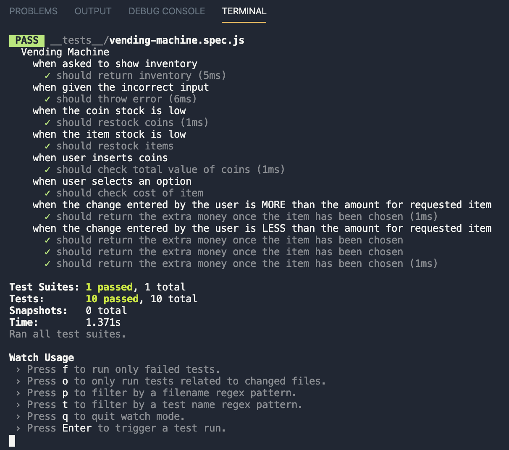

# Vending Machine

A project to implement a vending machine in JavaScript. Its also practice for a common coding inverview question.

### Installation

```
npm install
```

### Jest

```
npm test -- --watchAll
```

## Technologies Used

### JavaScript ES-6

Object-oriented programming language

### Jest

a library for testing JavaScript code


